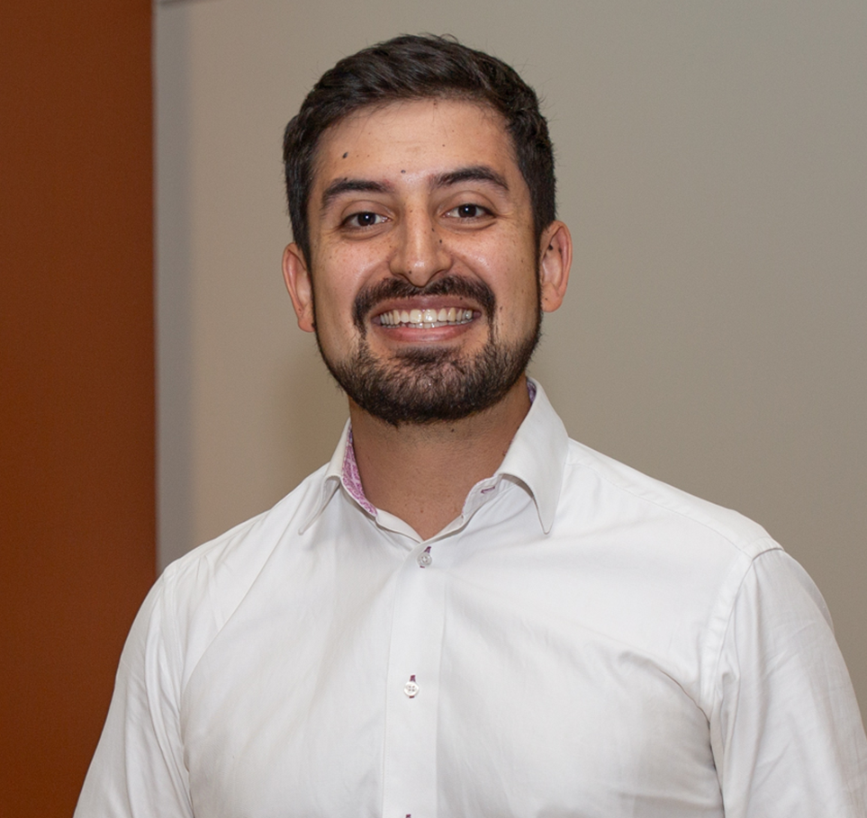

---
# Feel free to add content and custom Front Matter to this file.
# To modify the layout, see https://jekyllrb.com/docs/themes/#overriding-theme-defaults

layout: seminar
title: "Perspectives of Quantum Computing in Chemical Engineering"
date: 2025-11-06 3:00pm
author: David E. Bernal Neira
affiliation: Davidson School of Chemical Engineering, Purdue University
zoom: https://mit.zoom.us/j/94572304107?from=addon
---
# Abstract

Quantum technologies have attracted considerable interest, and among them, quantum computing has been attracting significant public attention recently. This interest is driven by the advancements in hardware, software, and algorithms required for its successful usage and the promise that it entails the potential acceleration of computational tasks compared to classical computing. This perspective talk presents a review of quantum computing, how this computational approach solves problems, and three fields that quantum computing can potentially impact the most, which are relevant to chemical engineering: computational chemistry, optimization, and machine learning. Here, we present a series of chemical engineering applications, the developments, potential improvements concerning classical computing, and challenges that quantum computing faces in each field. The first part of this talk intends to provide a clear picture of the challenges and potential advantages that quantum technology may yield for chemical engineering, together with an invitation for our colleagues to join us in the adoption and development of quantum computing. This part corresponds to the invited <a href="https://doi.org/10.1002/aic.17651">publication</a> on Perspectives on Quantum Computing for Chemical Engineering at the AIChE Journal and received the best talk award at the Quantum Computing Applications in Chemical and Biochemical Engineering Workshop in 2022.

# Speaker Bio

David E. Bernal Neira is an Assistant Professor in the Davidson School of Chemical Engineering at Purdue University. His research centers on mathematical optimization, artificial intelligence, and computational methods for solving scientific and engineering problems, with applications in process systems, energy, and chemical engineering. His core expertise is in nonlinear discrete optimization, encompassing theory, algorithms, and software. He also leads research in quantum computing, with emphasis on quantum algorithms for optimization, computational chemistry, and machine learning. He has co-authored peer-reviewed publications, developed open-source tools, and delivered invited talks across academia, government, and industry. He has taught several courses, including one he co-designed on optimization, quantum computing, and machine learning. He collaborates broadly with researchers in academia, national laboratories, government agencies, and industry. At Purdue, he leads the <a href="https://sequoia.github.io/">SECQUOIA</a> lab (Systems Engineering via Classical and QUantum Optimization for Industrial Applications).

