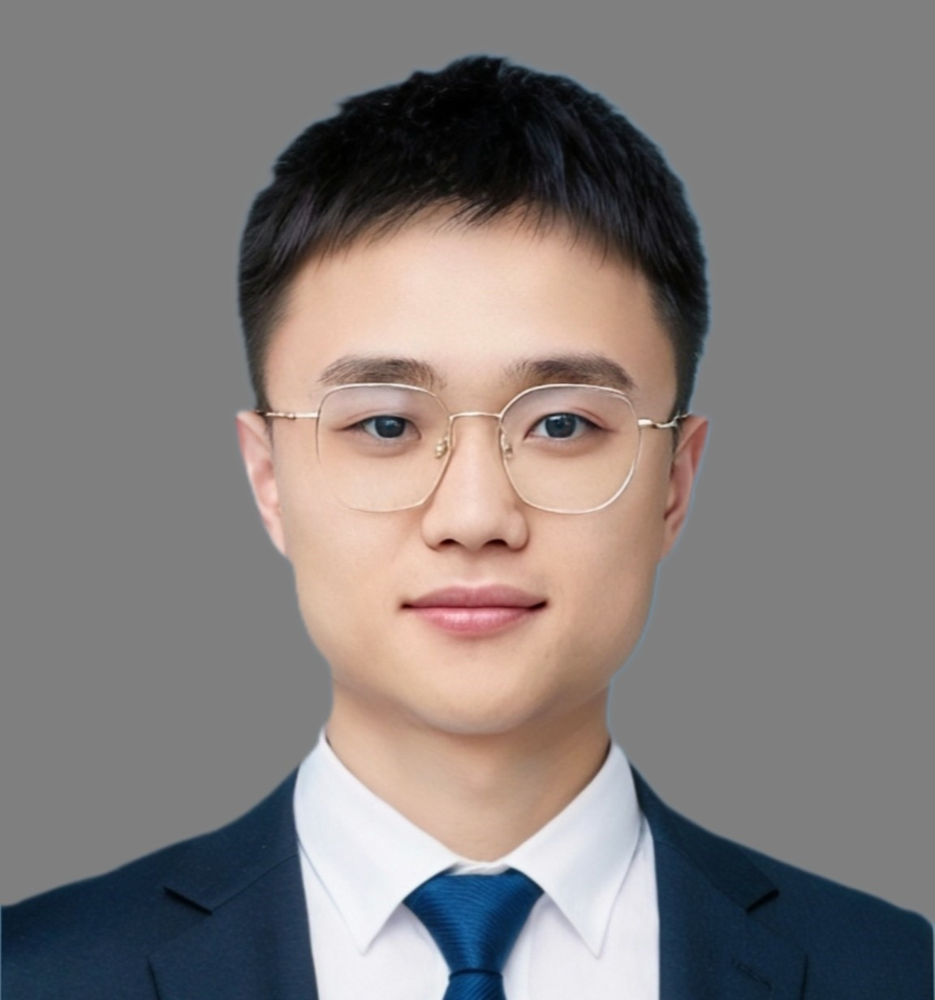

---
# Feel free to add content and custom Front Matter to this file.
# To modify the layout, see https://jekyllrb.com/docs/themes/#overriding-theme-defaults

layout: seminar
title: "Intelligent health diagnosis and prognosis for Lithium-ion batteries"
date: 2025-10-30 2:00pm
author: Yunhong Che
affiliation: Department of Chemical Engineering, Massachusetts Institute of Technology
zoom: https://mit.zoom.us/j/97406187542
---
# Abstract

Accurate and reliable state monitoring, health diagnosis, and lifetime prediction are critical to ensure the safe operation of batteries in energy storage systems. Factors such as different battery types, varying battery pack topologies, diverse user scenarios, and regional characteristics contribute to significant pattern differences, thus challenging optimal management. Integrating artificial intelligence technologies has brought new opportunities for the intelligent management of batteries. However, existing battery system management still faces challenges such as low model generalizability, poor generalization capability, and weak mechanistic interpretability. This seminar will introduce hybrid modeling approaches to enhance battery monitoring and health assessment. Two main strategies, including the mechanistic leading residual compensation and the mechanistic constrained machine learning, will be discussed. Both the monitoring of cell-scale and electrode-scale health will be introduced with hybrid approaches, where the main macroscopic and microscopic states that are critical for battery management will be included. This seminar highlights the combination of mechanistic information and machine learning for enhanced battery diagnosis and prognosis to improve accuracy, reliability, and interpretability in intelligent battery management.

# Speaker Bio

Yunhong Che received the Ph.D. degree in Electrical Engineering from the Department of Energy, Aalborg University, Aalborg, Denmark, in 2024. He previously received the B.E. and M.S. degrees in Automotive Engineering from the College of Mechanical and Vehicle Engineering, Chongqing University, Chongqing, China, in 2019 and 2021, respectively. He was a visiting student researcher with the Institute of Civil Engineering, the Swiss Federal Institute of Technology in Lausanne (EPFL), Lausanne, Switzerland, and the Department of Energy Science & Engineering, Stanford University, Stanford, USA, in 2023. He is currently a postdoctoral researcher at the Department of Chemical Engineering, MIT, Cambridge, USA, and was previously at the Department of Energy at Aalborg University, Aalborg, Denmark. His research interests include battery health prognostics and management, battery fault diagnostics, data-physics coupling in battery modeling and monitoring, and intelligent management for energy storage systems.

