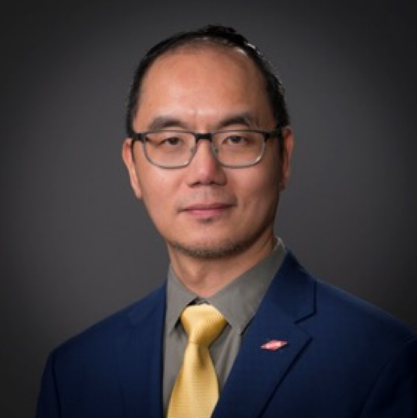

---
# Feel free to add content and custom Front Matter to this file.
# To modify the layout, see https://jekyllrb.com/docs/themes/#overriding-theme-defaults

layout: seminar
title: "The future is now: AI and humans working in the loop in process systems engineering"
date: 2025-04-17 2:00pm
author: Leo Chiang
affiliation: Dow Chemical
# zoom: https://mit.zoom.us/j/123456789
---
# Abstract

To enhance safety, reliability, and productivity of industrial processes and to accelerate materials discovery, artificial intelligence (AI) and machine learning techniques have been widely used in process industries for many decades. In the current Industry 4.0 and digital era, AI propels advancement in a wide range of applications in process systems engineering (PSE) including image analytics, large language model (LLM), deep learning, reinforcement learning, hybrid modeling, and real-time analytics.  

As more AI successes are demonstrated in process industries, there is a growing misconception that AI is to replace human decision. The talk will emphasize the need for of Responsible/Trustworthy AI and show industrial examples on how humans and AI must be working in the loop. One aspect is to understand how to incorporate AI methods to assist humans to accelerate discovery in research and to make well-informed decisions in manufacturing operations. The other aspect is to allow humans to incorporate engineering and science domain knowledge to make AI methods smarter. This talk aims to showcase AI success stories in PSE. The discussion will extend to anticipated research paths, the necessity for workforce development, and the imperative collaboration between academia, technology providers, and the industry to further exploit AI's potential.

# Speaker Bio

Leo Chiang is a Senior R&D Digital Fellow at Core R&D of The Dow Chemical Company. He has extensive research interests in emerging AI and Data Science approaches and his ambition is to guide the company to achieve AI at scale.  Leo is responsible for global R&D digital strategy, including digital IP & monetization strategy, Generative AI and LLM strategy, and responsible AI principles Leo is on a mission to improve data acumen for workforce at all levels at Dow; He co-developed data science training program and championed many activities to foster cross functional collaboration.  He is proactive in working with universities to support data science education in chemical engineering and the broader STEM community. 

Leo has a B.S. degree from University of Wisconsin at Madison and M.S. and Ph.D. degrees from the University of Illinois at Urbana-Champaign, all in Chemical Engineering.  Leo has co-authored 2 books, over 70 externally refereed journal/proceedings papers and has given over 160 conference presentations and university lectures.  

Over  the past decade, Leo served as a Computer Aids for Chemical Engineering (CACHE) trustee (2019-2024) and held a number of American Institute of Chemical Engineers (AIChE) leadership positions, including Executive Board of the Program Committee (EBPC) chair (2022), spring meeting program chair (2018), Industry 4.0 topical conference chair (2018-2020), Big data analytics topical conference chair (2015-2017), and  Computing and Systems Technology (CAST) director (2014-2016).  Leo is currently a board member of the National Academies' Board on Chemical Sciences and Technology (BCST), industry co-chair of 2025 Dynamics and Control of Process Systems (DYCOPS) conference, and program chair of 2026 Foundations of Process/Product Analytics and Machine learning (FOPAM) meeting.  

Leo is a Fellow of AIChE and has received many recognitions including the 2016 Herbert Epstein Award, 2016 Computing Practice Award, and American Automatic Control Council 2020 Control Engineering Practice Award.  He was elected to the National Academy of Engineering (NAE) in 2023.

