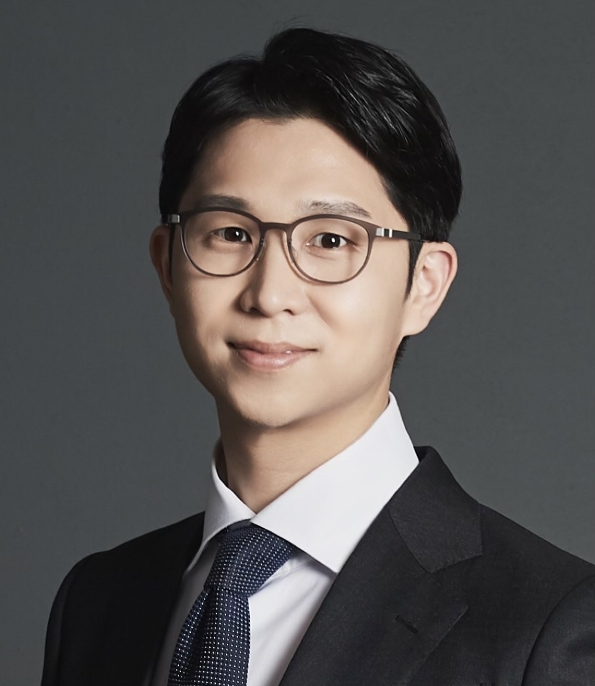

---
# Feel free to add content and custom Front Matter to this file.
# To modify the layout, see https://jekyllrb.com/docs/themes/#overriding-theme-defaults

layout: seminar
title: "coming soon"
date: 2025-11-20 2:00pm
author: Moo Sun Hong
affiliation: Department of Chemical and Biological Engineering, Seoul National University
zoom: coming soon
---
# Abstract

coming soon

# Speaker Bio

Moo Sun Hong is an Assistant Professor in the Department of Chemical and Biological Engineering at Seoul National University (SNU). He received a B.S. from SNU and an M.S. and Ph.D. from Massachusetts Institute of Technology (MIT). His honors include the AIChE Separations Division Graduate Student Research Award and the AIChE PD2M Award for Excellence in Integrated QbD Practice. His research focuses on advancing biomanufacturing systems through a systems engineering approach, integrating mechanistic modeling with data analytics and artificial intelligence to enable hybrid modeling, optimal design and control, and ultimately automated process construction.

