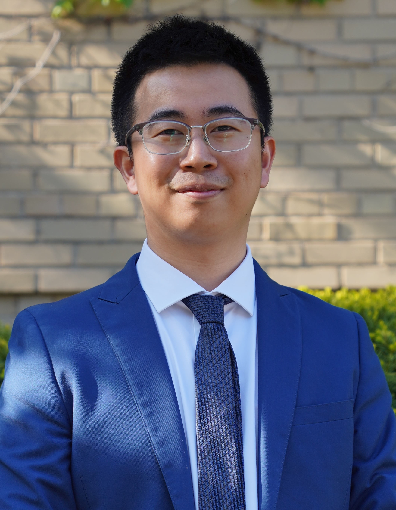

---
# Feel free to add content and custom Front Matter to this file.
# To modify the layout, see https://jekyllrb.com/docs/themes/#overriding-theme-defaults

layout: seminar
title: "Polymer physics meets machine learning: a synergistic approach to complex polymer design"
date: 2025-02-13 3:00pm
author: Shengli (Bruce) Jiang
affiliation: Princeton University
zoom: https://mit.zoom.us/j/99418937411?pwd=DvV62UslcbKBjelcwGOqAbJax745tk.1
---
# Abstract

Understanding and designing polymers with target structural and/or functional properties are grand challenges in materials science. Traditional polymer physics frameworks provide essential theoretical foundations for understanding the behavior of polymer-based materials, yet they struggle to deliver chemically specific insights or practical design guidance. Although artificial intelligence and machine learning approaches have significantly advanced the design of materials, including polymers, their success has been primarily restricted to simpler systems, particularly linear homopolymers. Furthermore, the limited availability of requisite data poses an ongoing challenge for such computational methods.

In this talk, I will outline our recent work integrating simulation, machine learning, and polymer physics principles to investigate complex polymer design spaces and establish structure-function relationships for chemically and topologically diverse polymers. I will first demonstrate how generative machine learning addresses the combinatorial challenges inherent in chain architecture design, enabling us to develop broader structure-function relationships. Building on this foundation, I will describe our approach combining active-learning directed simulation with generative machine learning techniques to control rheological characteristics through manipulation of polymer topology and chemistry. Finally, I will explain how essential concepts from polymer physics can be incorporated into natively naive algorithms to enhance data efficiency and model efficacy. 

# Speaker Bio

Dr. Shengli Jiang is a postdoctoral associate at Princeton University, where he works with Professor Michael Webb on integrating molecular simulation and machine learning to design complex polymers. He earned his Ph.D. in Chemical Engineering from the University of Wisconsin-Madison in 2023 under the supervision of Professor Victor Zavala, focusing on data representation and machine learning applications in chemical engineering. He received his B.S. in Chemical Engineering from the University of California, San Diego in 2018, working with Professor Zheng Chen on lithium-ion battery cathode materials design.

