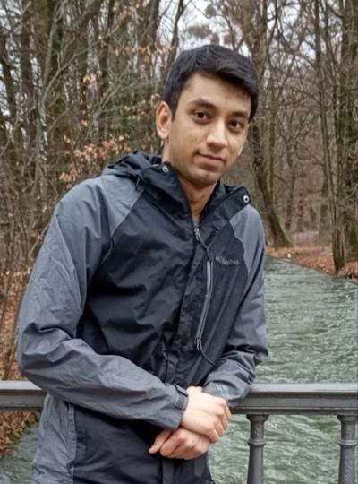

---
# Feel free to add content and custom Front Matter to this file.
# To modify the layout, see https://jekyllrb.com/docs/themes/#overriding-theme-defaults

layout: seminar
title: On optimal control of hybrid dynamical systems using complementarity constraints – discretization and globalization
date: 2025-02-27 2:00pm
author: Saif Kazi
affiliation: Los Alamos National Laboratory
# zoom: https://mit.zoom.us/j/123456789
---
# Abstract

Hybrid Dynamical Systems are an important way to model multiple physical processes like contact based mechanical systems and vapor liquid equilibrium systems. Optimal control of hybrid dynamical systems requires modeling and solving the non-smooth dynamics with kinks using complementarity constraints aka MPECs. Unfortunately, higher order numerical integration methods fail to achieve desired accuracy with uniform discretization grid. Adaptive discretization methods which can detect these non-smooth points accurately are required to solve these optimal control problems (OCP) accurately. In this talk, I will discuss the (1) moving finite element (MFE) strategy for locating the switch points and enforcing sufficient smoothness condition on the solution. (2) globally convergent method for MPECs which can avoid convergence to spurious solutions from NLP relaxation methods. Few examples will be presented to showcase the efficacy of the proposed approach compared to the traditional methods.

# Speaker Bio

Dr. Saif Kazi is a Research Scientist in the Applied Mathematics & Plasma Physics group at Los Alamos National Lab (LANL). Prior to this, he was a Center for Nonlinear Studies Postdoctoral Fellow at LANL. His research interests are in nonlinear modeling and optimization with applications in energy systems such as power and gas grid networks and control of dynamical systems such as robots and spacecraft. Saif obtained his PhD and B.Tech in Chemical Engineering from Carnegie Mellon University and Indian Institute of Technology Bombay respectively.

