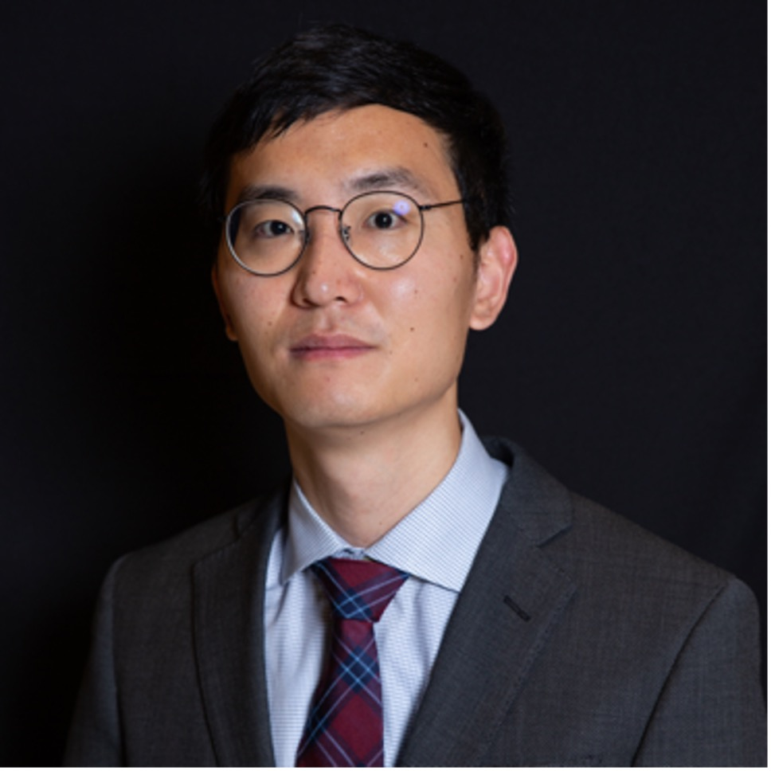

---
# Feel free to add content and custom Front Matter to this file.
# To modify the layout, see https://jekyllrb.com/docs/themes/#overriding-theme-defaults

layout: seminar
title: Intersection of optimization and machine learning in process systems engineering
date: 2025-04-10 2:00pm
author: Can Li
affiliation: Purdue University
# zoom: https://mit.zoom.us/j/123456789
---
# Abstract

Optimization and machine learning have become essential tools in Process Systems Engineering (PSE), driving advancements in process modeling, control, and decision-making. This seminar explores two key developments at their intersection: physics-informed neural networks (PINNs) for surrogate modeling and large language models (LLMs) for optimization explainability.
The first part introduces KKT-hPINN, a novel physics-informed neural network that integrates hard physical constraints into neural networks using Karush-Kuhn-Tucker (KKT) conditions. Traditional PINNs incorporate physics through soft constraints but fail to strictly enforce them in predictions. In contrast, KKT-hPINN ensures that linear equality constraints are rigorously satisfied through projection layers derived from KKT conditions, improving both generalization and data efficiency. Numerical experiments on Aspen models of a continuous stirred-tank reactor (CSTR) unit, an extractive distillation subsystem, and a chemical plant demonstrate that KKT-hPINN enhances prediction accuracy over standard PINNs.
The second part presents OptiChat, a chatbot powered by large language models (LLMs) designed to explain optimization models. A major challenge in deploying optimization-based decision-making is the difficulty practitioners face in interpreting and troubleshooting these models. OptiChat addresses this by diagnosing infeasibilities, conducting sensitivity analyses, generating counterfactual explanations, and responding to user queries. It has been tested on a diverse dataset of optimization-related questions to evaluate its effectiveness.
The seminar will conclude with a discussion on the broader opportunities and limitations of applying LLMs in optimization, highlighting future research directions at the intersection of AI and mathematical optimization.

# Speaker Bio

Can obtained his bachelor’s degree from Tsinghua University, China, in Chemical Engineering. He completed his PhD in Chemical Engineering at Carnegie Mellon University. His PhD research is focused on stochastic mixed-integer nonlinear programming and long-term expansion planning of power systems. Can did a one-year Postdoc at Polytechnique Montreal on using machine learning techniques to accelerate optimization algorithms. He joined the Davidson School of Chemical Engineering at Purdue University as an assistant professor in the Fall of 2022. His research group is focused on optimization, machine learning, and applications in sustainable energy systems. His group won Air Liquide’s global scientific challenge on data sharing for decarbonization in 2023, the Amazon Research Award in 2024, the NSF CAREER Award in 2025.

