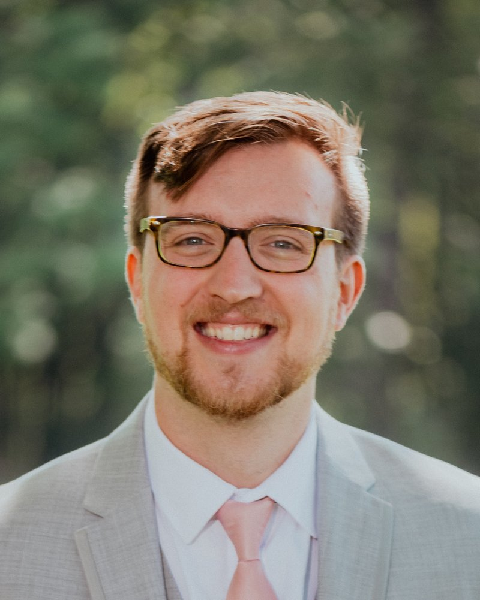

---
# Feel free to add content and custom Front Matter to this file.
# To modify the layout, see https://jekyllrb.com/docs/themes/#overriding-theme-defaults

layout: seminar
title: Distributional uncertainty and model predictive control
date: 2025-03-13 2:00pm
author: Robert McAllister
affiliation: TU Delft
# zoom: https://mit.zoom.us/j/123456789
---
# Abstract

With the increasing availability of data and advancements in computational capabilities, we are now better equipped to characterize and directly incorporate probability distributions into control algorithms. Stochastic Model Predictive Control (SMPC), in particular, leverages these distributions to formulate a stochastic optimization problem, solving it at each time step to determine the optimal action following the standard receding horizon approach. However, the available probability distribution is not perfect. Discrepancies between this estimated distribution and the "true" distribution, referred to as distributional uncertainty, are inevitable and can impact controller performance. In this talk, we will discuss two approaches to address distributional uncertainty: (i) Ensuring that SMPC is inherently robust to such uncertainty, and (ii) Explicitly incorporating distributional uncertainty into the algorithm formulation via Distributionally Robust Model Predictive Control (DRMPC). For both approaches, I will present theoretical results and simple examples to illustrate their implications.

# Speaker Bio

Dr. R.D. (Koty) McAllister is an Assistant Professor in the Delft Center for Systems and Control (DCSC) at TU Delft. His research focuses on model predictive control, stochastic and distributional robustness of closed-loop systems, and data-driven control methods with applications in energy and agricultural systems. He received the PhD degree in chemical engineering from the University of California, Santa Barbara in 2022 and the Bachelor degree of chemical engineering from the University of Delaware in 
2017. Prior to his assistant professor position, he was a postdoc in DCSC working with Peyman Mohajerin Esfahani. He is the recipient of the 2021 Schlinger Fellowship and 2022 CCDC PhD Best Thesis Award from the University of California, Santa Barbara. 

