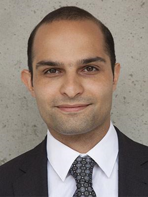

---
# Feel free to add content and custom Front Matter to this file.
# To modify the layout, see https://jekyllrb.com/docs/themes/#overriding-theme-defaults

layout: seminar
title: Learning Interpretable Control Policies with Local Actions and Global Optimality
date: 2025-09-25 2:00pm
author: Ali Mesbah
affiliation: Department of Chemical and Biomolecular Engineering, University of California, Berkeley
zoom: https://mit.zoom.us/j/91753544242?from=addon
---
# Abstract

Making optimal decisions under uncertainty is a shared problem among distinct fields. While optimal control is commonly studied in the framework of dynamic programming, it is approached with differing perspectives of the Bellman optimality condition. In one perspective, the Bellman equation is used to derive a global optimality condition useful for iterative learning of control policies through interactions with an environment. Alternatively, the Bellman equation is also widely adopted to derive tractable optimization-based control policies that satisfy a local notion of optimality. By leveraging ideas from the two perspectives, we present a local-global paradigm for optimal control suited for learning interpretable local decision makers that approximately satisfy the global Bellman equation. The benefits and practical complications in local-global learning are discussed. These aspects are exemplified through case studies, which give an overview of two distinct strategies for unifying reinforcement learning and model predictive control. We discuss the challenges and trade-offs in these local-global strategies, towards highlighting future research opportunities for safe and optimal decision-making under uncertainty.

# Speaker Bio

Ali Mesbah is Associate Professor of Chemical and Biomolecular Engineering at the University of California at Berkeley. Before joining UC Berkeley, Dr. Mesbah was a senior postdoctoral associate at MIT. He holds a Ph.D. degree in Systems and Control and a Master’s degree in Chemical Engineering, both from Delft University of Technology. Dr. Mesbah is a senior member of the IEEE and AIChE. He serves on the Editorial Boards of the IEEE Transactions on Control Systems Technology, IEEE Control Systems Letters, and IEEE Transactions on Radiation and Plasma Medical Sciences. Dr. Mesbah is recipient of the O. Hugo Schuck Best Paper Award in 2024, the Alexander von Humboldt Research Award in 2023, the Best Application Paper Award of the IFAC World Congress in 2020, the AIChE's 35 Under 35 Award in 2017, the IEEE Control Systems Outstanding Paper Award in 2017, and the AIChE CAST W. David Smith, Jr. Publication Award in 2015. His research interests lie at the intersection of optimal control, machine learning, and applied mathematics, with applications to learning-based analysis, optimization, and predictive control of materials processing and manufacturing systems.

