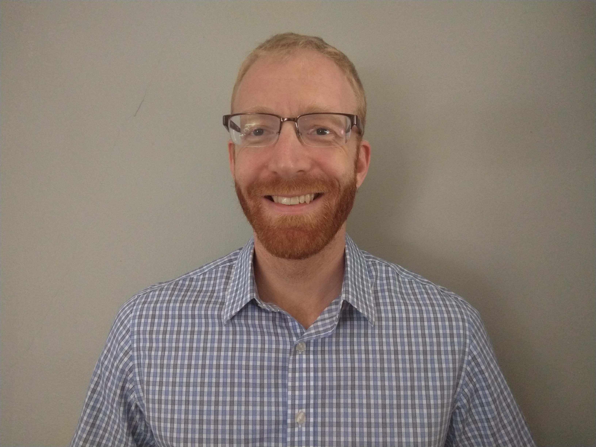

---
# Feel free to add content and custom Front Matter to this file.
# To modify the layout, see https://jekyllrb.com/docs/themes/#overriding-theme-defaults

layout: seminar
title: "Decomposition Methods for the Guaranteed Global Solution of Nonconvex Stochastic Programs: State-of-the-Art and Future Outlook"
date: 2025-10-02 3:00pm
author: Joseph K. Scott
affiliation: Department of Chemical and Biomolecular Engineering, Georgia Institute of Technology
zoom: https://mit.zoom.us/j/99329340034?from=addon
---
# Abstract

Many optimization problems of the highest societal importance take the form of large-scale mixed-integer nonlinear programs (MINLPs). Often, high-quality solutions cannot be obtained by local or heuristic methods. Instead, guaranteed global solutions are needed. Unfortunately, decades of development make it clear that global solvers are very unlikely to address these problems without decomposition approaches that enable effective parallel computing and (more importantly) reduce the worst-case exponential complexity of the centralized problem. Among all large-scale MINLPs, two-stage stochastic MINLPS offer perhaps the most natural decomposable structure, and recent years have seen the development of the first guaranteed global decomposition methods for these problems. Yet, despite their theoretical advantages, these algorithms remain seriously underpowered and have not yet enabled the solution of many problems that could not be solved with conventional centralized methods. In this talk, we will review the state-of-the-art global decomposition approaches for two-stage stochastic MINLPs, and then present recent theoretical and empirical analyses aimed at understanding their limitations. Our results point to critical theoretical issues (born out in numerical experiments on real applications) with implications that extend well beyond the currently available methods. The talk will conclude with a discussion of critical needs for future method development, possible approaches, and our general outlook on what is likely (and unlikely) to be possible with global decomposition methods.

# Speaker Bio

Joseph K. Scott is an Associate Professor in the Department of Chemical and Biomolecular Engineering at the Georgia Institute of Technology. He received his B.S. (2006) in Chemical Engineering from Wayne State University, and his M.S. (2008) and Ph.D. (2012) in Chemical Engineering from MIT. His honors include the 2012 Best Paper Award from the Journal of Global Optimization, the 2014-2016 Automatica Paper Prize from the International Federation of Automatic Control, the 2016 Air Force Young Investigator Research Program Award, and the 2022 Outstanding Young Researcher Award from the Computing and Systems Technology Division of the AIChE. His research interests include dynamical systems, optimization theory, simulation and optimization of chemical processes, advanced process control, and set-based computing.

