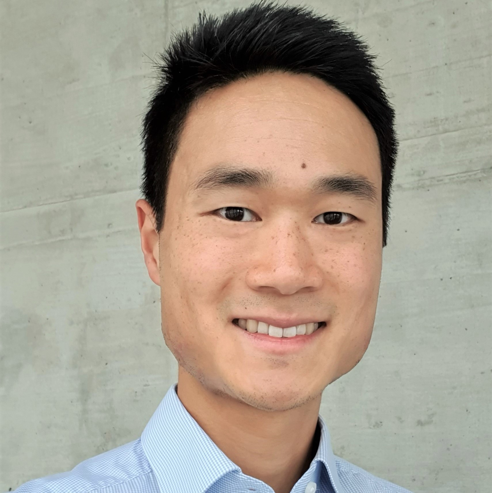

---
# Feel free to add content and custom Front Matter to this file.
# To modify the layout, see https://jekyllrb.com/docs/themes/#overriding-theme-defaults

layout: seminar
title: "Environmental life-cycle assessment for sustainable energy systems"
date: 2025-10-09 2:00pm
author: David Y. Shu
affiliation: Massachusetts Institute of Technology
zoom: https://mit.zoom.us/j/97046262504?from=addon
---
# Abstract

Life-cycle assessment (LCA) is an established methodology for quantifying the environmental impacts of processes. In this case-study-focused talk, I will share insights from two demonstrator projects that explore the life-cycle environmental impacts of carbon capture and storage (CCS) supply chains. These assessments, based on detailed process inventories, identify environmental hotspots in emerging sustainable technologies before large-scale deployment. We will also discuss how integrating process-level environmental assessments into broader system-level analyses can reveal system-wide knock-on effects. In particular, the talk will examine how deploying carbon capture influences the environmental footprint of net-zero energy systems and why it is essential to consider impacts beyond climate change to ensure sustainable system design.

# Speaker Bio

David Yang Shu is a postdoctoral associate in Professor Sungho Shin’s group at MIT, where he works on nonlinear optimal design of carbon capture units under uncertainty. His research spans environmental life-cycle assessment, process optimization, and sustainable system design, with applications in carbon capture and storage technologies and the broader energy transition. 
David earned his PhD from ETH Zurich, where he studied the design and operation of net-zero energy systems using multi-criteria optimization to evaluate trade-offs between economic and environmental objectives. He also applied bilevel optimization to model market interactions during the transition to net-zero systems. David contributed to the Horizon 2020 project DMX™ Demonstration in Dunkirk (3D) through full-scale CCUS supply chain assessments and to the Swiss demonstration project DemoUpCARMA, focusing on CO₂ transportation.

<strong>References:</strong>
<ul>
  <li><a href="https://doi.org/10.1016/j.ijggc.2025.104396" target="_blank">Demonstration of the DMX™ technology for carbon capture and storage in steel production: An environmental assessment</a>, <em>International Journal of Greenhouse Gas Control </em>, 2025, 146, 104396</li>
  <li><a href="https://doi.org/10.1016/j.jclepro.2025.145659" target="_blank">How to transport carbon dioxide today and tomorrow? A prospective life cycle assessment</a>, <em>Journal of Cleaner Production </em>, 2025, 514, 145659</li>
  <li><a href="https://doi.org/10.1016/j.rser.2023.113246" target="_blank">The role of carbon capture and storage to achieve net-zero energy systems: Trade-offs between economics and the environment</a>, <em>Renewable and Sustainable Energy Reviews</em>, 2023, 178, 113246</li>
  <li><a href="https://doi.org/10.69997/sct.126329" target="_blank">Towards designing sector-coupled energy systems within planetary boundaries</a>, <em>Systems & Control Transactions</em>, 2024, 3, 585-590</li>
  <li><a href="https://doi.org/10.3389/fenrg.2022.884525" target="_blank">SecMOD: An Open-Source Modular Framework Combining Multi-Sector System Optimization and Life-Cycle Assessment</a>, <em>Frontiers in Energy Research</em>, 2022, 10</li>
</ul>

