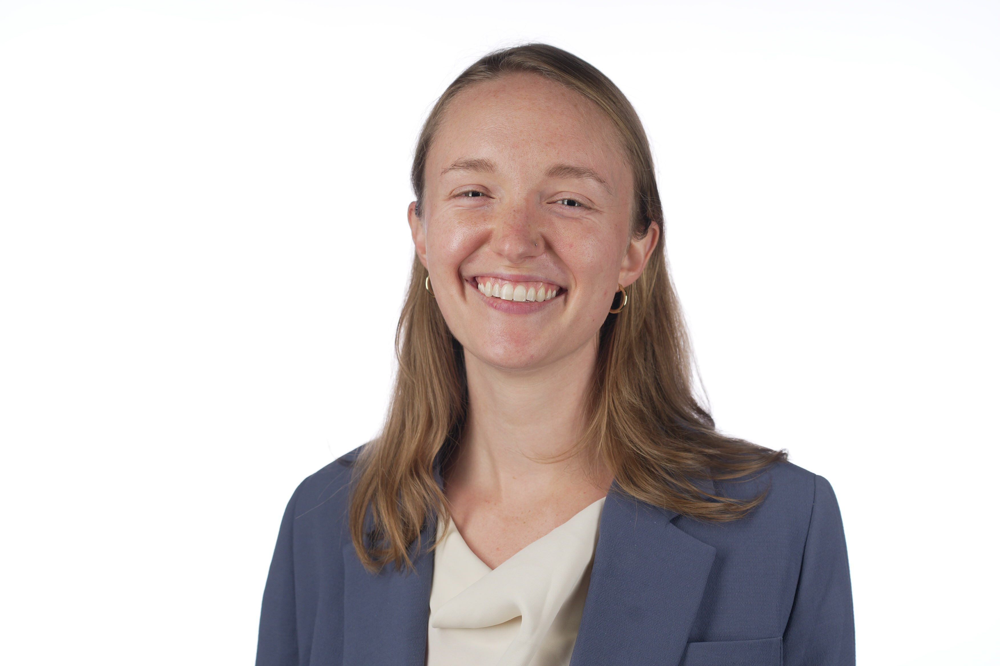

---
# Feel free to add content and custom Front Matter to this file.
# To modify the layout, see https://jekyllrb.com/docs/themes/#overriding-theme-defaults

layout: seminar
title: Optimal design approaches for rapid, cost-effective manufacturing and
deployment of chemical process families
date: 2025-05-01 3:00pm
author: Georgia Stinchfield
affiliation: Carnegie Mellon University
# zoom: https://mit.zoom.us/j/123456789
---
# Abstract

Enabling the rapid and widespread deployment of multiple process variants across various
design requirements is essential for ensuring the broad availability of critical decentralized
technologies, such as carbon capture systems. Unfortunately, traditional process design
methods that treat each variant independently are ine:icient for quickly designing large
numbers of process variants. We have proposed viewing the entire set of variants as a
process family, and developed an optimization formulation for designing the entire family
simultaneously while exploiting opportunities for shared sub-components (i.e., platform).
We formulate this problem as a Nonlinear Generalized Disjunctive Program, which quickly
proved intractable when using off-the-shelf solvers. We introduced a methodology that
discretizes the design range, resulting in a large-scale MILP; additionally, we employed
piecewise linear ML surrogates, embedding them within the optimization problem to replace
complex nonlinear functions. While effective, both of these approaches rely on extensive
precomputation with the model to obtain the necessary input data. To address this
bottleneck, we also propose directly solving the nonlinear GDP considering the rigorous
equation-oriented nonlinear system model within the optimization formulation. While a
challenging large-scale MINLP, this problem exhibits a block-angular structure that allows
us to consider decomposition techniques. We have successfully solved a large-scale
discretized problem using the Progressive Hedging (PH) algorithm, an iterative approach
developed for stochastic programs, however, this algorithm does not guarantee
convergence except in the case of linear programs. Our current work focuses on
decomposition and global optimization to tackle the originally intractable Nonlinear
Generalized Disjunctive Program. We are developing a general-purpose solver, SNoGloDe
(Structured Nonlinear Global Decomposition) in Python using the algebraic modeling
language Pyomo to address block-angular decomposable problems, utilizing a tailored
spatial branch and bound tree for decomposition.

# Speaker Bio

Georgia Stinchfield is a fourth-year Doctoral candidate in the Department of Chemical
Engineering at Carnegie Mellon University. She is advised by Prof. Carl Laird, conducting
research in mathematical programming (decomposition techniques and global
optimization) with applications in process systems engineering and product family design.
While pursuing her PhD, Georgia has been awarded the Thomas and Adrienne Klopack
Graduate Fellowship, the Eastman Chemical Company Fellowship, and a Carnegie Mellon
Presidential Fellowship. She was also awarded a Best Oral Presentation at the 33rd annual
ESCAPE (European Symposium on Computer Added Process Engineering) conference and
recognized with the ChEGSA (Chemical Engineering Graduate Student Association)
Symposium Oral Presentation Award. Previously, Georgia earned a Bachelor of Science in
Chemical Engineering from Manhattan College, minoring in Computer Science and
Mathematics.

