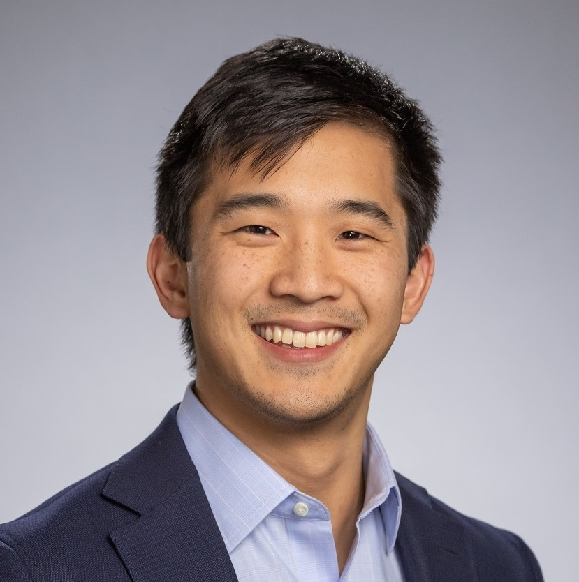

---
# Feel free to add content and custom Front Matter to this file.
# To modify the layout, see https://jekyllrb.com/docs/themes/#overriding-theme-defaults

layout: seminar
title: Optimization approaches for bounding and certifying neural networks
date: 2025-02-20 2:00pm
author: Calvin Tsay
affiliation: Imperial College London
zoom: https://mit.zoom.us/j/91281296272?pwd=MErB89MHSnA4O7MI0gdjf0tuWoxe2H.1
---
# Abstract

Neural networks are central to many machine learning methods and engineering applications, but they generally lack guarantees on their properties/performance. Formal certification of neural networks is crucial for ensuring safety, particularly when deploying them in safety-critical engineering domains. This talk outlines how mathematical optimization provides a framework to certify properties of neural networks, i.e., by solving (or bounding) a mixed-integer program based on the network. While mixed-integer programming suffers from scalability issues, we review how bound-tightening techniques and efficient relaxations can help improve tractability. Throughout this talk, we focus on two key applications: (1) certifying performance of neural network controllers, and (2) bounding the effects of data poisoning/manipulation during training. For the latter, we leverage convex relaxations to over-approximate the set of possible parameter updates, effectively bounding the set of all reachable parameters under data manipulation. We demonstrate our approach on multiple real-world datasets from applications including energy usage, medical imaging, and autonomous driving. 

# Speaker Bio

Dr Calvin Tsay is Assistant Professor (UK Lecturer) in the Department of Computing at Imperial College London, where he also holds a BASF/Royal Academy of Engineering Senior Research Fellowship. Prior to his appointment as lecturer, he was an EPSRC David Clarke Fellow and Imperial College Research Fellow. His research focuses on machine learning and computational optimization, with applications in energy and process systems engineering. Calvin received his PhD degree in Chemical Engineering from the University of Texas at Austin and his BS and BA from Rice University (Houston, TX). He is the recipient of the 2021 CPAIOR Conference Distinguished Paper Award, the 2022 COIN-OR Cup, and the 2022 W. David Smith, Jr. Graduate Publication Award from the CAST Division of the American Institute of Chemical Engineers.

