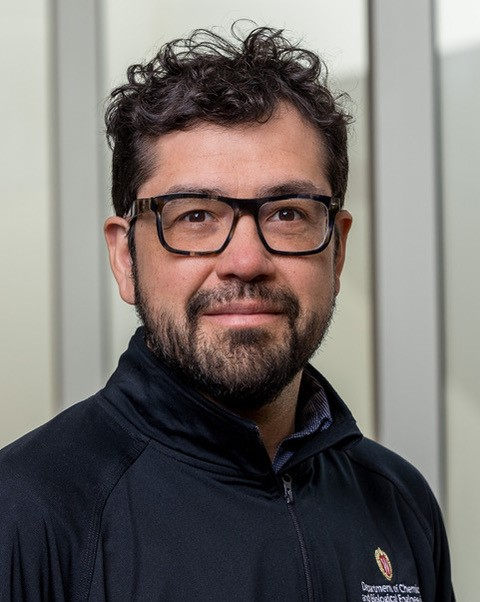

---
# Feel free to add content and custom Front Matter to this file.
# To modify the layout, see https://jekyllrb.com/docs/themes/#overriding-theme-defaults

layout: seminar
title: "From Molecules to Supply Chains: Transforming Data to Decisions using Geometry, Optimization, and Machine Learning"
date: 2025-12-04 3:00pm
author: Victor M. Zavala
affiliation: Department of Chemical and Biological Engineering, University of Wisconsin-Madison
zoom: coming soon
---
# Abstract

We discuss how geometry, optimization, and machine learning are key technologies that are revolutionazing the way we think about data and the way we transform data into actionable models and decisions. Specifically, we explain how complex data (e.g., text, molecules, time series, images/video, supply chain flows) can be represented as geometrical objects and how this faciltates interpretation and extraction of useful information from data. We also discuss how extracted information can be mapped into decisions using optimization and machine learning models. We illustrate how to use these powerful math tools in innovative ways for analyzing complex datasets arising in molecular dynamics simulation, microscopy, chemical processes, and suppy chains. Specifically, we show that these tools can help link the microstructure of soft gels to their rheological properties, can help analyze complex responses of liquid crystals from video data, and can help detect faults and optimize large-scale systems.

# Speaker Bio

Victor M. Zavala is the Baldovin-DaPra Professor in the Department of Chemical and Biological Engineering at the University of Wisconsin-Madison and is affiliated with the Mathematics and Computer Science Division at Argonne National Laboratory. He holds a B.Sc. degree from Universidad Iberoamericana and a Ph.D. degree from Carnegie Mellon University, both in chemical engineering. He is an associate editor for ACS-I&ECR and is on editorial board of the journals Mathematical Programming Computation and Computers & Chemical engineering. He is a recipient of NSF and DOE Early Career awards and of the Presidential Early Career Award for Scientists and Engineers (PECASE). His research interests include data science, control, and optimization and applications to chemical, energy, and environmental systems.

